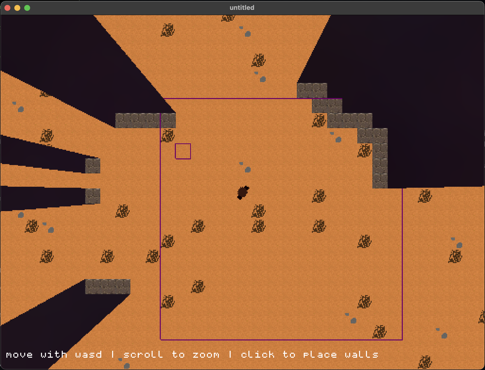

### untitled / Tile Engine

I have some ideas for where this is going but for now I'm just developing a somewhat generic overhead tile based engine.    
Currently, we have:
- infinite world generation (generator is a simple placeholder now, but data structures are in place)
- chunking system and renderer
- wall tiles can cast shadows, the renderer for this is built
- 2 stage downsample renderer can pixellate to the same scale as the pixel art
- developing action / event / engine side at the moment
- main branch is a demo in which you can walk around, place shadow casting blocks, look around
     

      
### How to build
CMake! Here's [my gfx lib's guide](https://github.com/collebrusco/flgl/tree/main/user#readme) for building projects that use it.    
If you're not new to this, it'll build like any typical CMake project.     
`mkdir build && cd build && cmake .. && make && cd .. && ./build/untitled`
